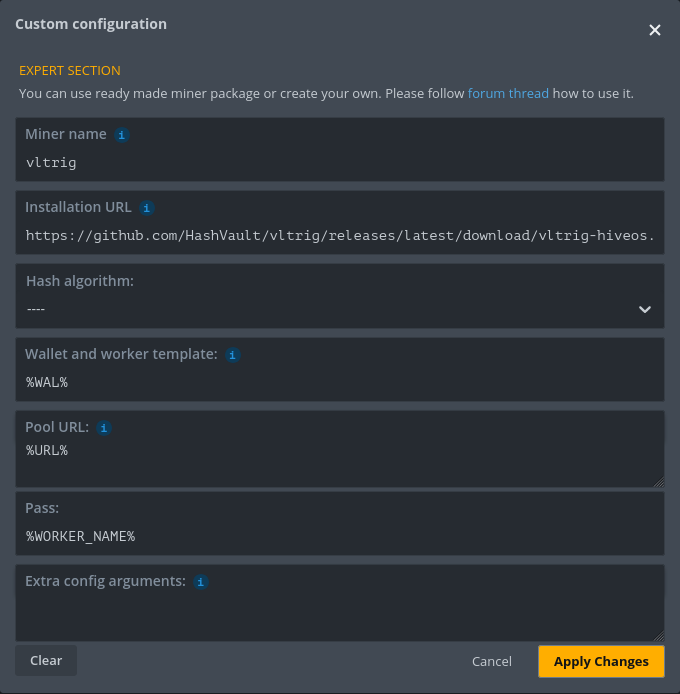

# vltrig

[](https://github.com/HashVault/vltrig/releases)
[](https://github.com/HashVault/vltrig/releases)
[](https://discord.hashvault.pro)
[](https://github.com/HashVault/vltrig/blob/master/LICENSE)

A fork of [XMRig](https://github.com/xmrig/xmrig) miner tailored for [HashVault](https://hashvault.pro) mining pools.

> **Anti-censorship first.** Helping miners bypass network restrictions and DNS blocking that prevent access to mining pools. Mining should be accessible to everyone, everywhere.

### Focus Areas

- Anti-censorship features (DoH, secure DNS resolution)
- UI/UX improvements
- HashVault pool optimizations
- Tracking upstream XMRig for updates and security fixes

### Not Changing

- Hashing algorithms
- Mining performance
- Donation mechanics (original XMRig donation is preserved)

---

## Table of Contents

- [Download](#download)
- [Install via APT (Ubuntu/Debian)](#install-via-apt-ubuntudebian)
- [Install via DNF (Fedora/RHEL)](#install-via-dnf-fedorarhel)
- [HiveOS](#hiveos)
- [Features](#features)
  - [DNS-over-HTTPS (DoH)](#dns-over-https-doh)
  - [RandomX Only](#randomx-only)
  - [Default Pool](#default-pool)
- [Building](#building)
- [Versioning](#versioning)
- [Upstream XMRig](#upstream-xmrig)
- [Contributing](#contributing)

---

## Download

Prebuilt binaries are available on the [**Releases**](https://github.com/HashVault/vltrig/releases) page.

| Platform | Architecture | Notes |
|----------|--------------|-------|
| Linux | x64 | Static binary (musl libc) |
| Windows | x64 | MinGW build |
| macOS | x64 | Intel Macs |
| macOS | ARM64 | Apple Silicon |

> **Note:** Prebuilt binaries are CPU-only. For GPU mining, build from source with `-DWITH_OPENCL=ON` and/or `-DWITH_CUDA=ON`.

---

## Install via APT (Ubuntu/Debian)

Quick install:

```
curl -fsSL https://hashvault.github.io/apt/KEY.gpg | sudo gpg --dearmor -o /usr/share/keyrings/hashvault.gpg && echo "deb [arch=amd64 signed-by=/usr/share/keyrings/hashvault.gpg] https://hashvault.github.io/apt stable main" | sudo tee /etc/apt/sources.list.d/hashvault.list && sudo apt update && sudo apt install -y vltrig
```

Step by step:

```bash
# Add the GPG key
curl -fsSL https://hashvault.github.io/apt/KEY.gpg | sudo gpg --dearmor -o /usr/share/keyrings/hashvault.gpg

# Add the repository
echo "deb [arch=amd64 signed-by=/usr/share/keyrings/hashvault.gpg] https://hashvault.github.io/apt stable main" | sudo tee /etc/apt/sources.list.d/hashvault.list

# Install
sudo apt update && sudo apt install vltrig
```

The binary installs to `/usr/bin/vltrig` with a default config at `/etc/vltrig/config.json`.

Start and enable the service:

```bash
sudo systemctl enable --now vltrig
```

To update:

```bash
sudo apt update && sudo apt upgrade vltrig
```

---

## Install via DNF (Fedora/RHEL)

Quick install:

```
sudo rpm --import https://hashvault.github.io/rpm/KEY.gpg && sudo tee /etc/yum.repos.d/hashvault.repo <<< $'[hashvault]\nname=HashVault\nbaseurl=https://hashvault.github.io/rpm\ngpgcheck=1\ngpgkey=https://hashvault.github.io/rpm/KEY.gpg\nenabled=1' && sudo dnf install -y vltrig
```

Step by step:

```bash
# Import the GPG key
sudo rpm --import https://hashvault.github.io/rpm/KEY.gpg

# Add the repository
sudo tee /etc/yum.repos.d/hashvault.repo << 'EOF'
[hashvault]
name=HashVault
baseurl=https://hashvault.github.io/rpm
gpgcheck=1
gpgkey=https://hashvault.github.io/rpm/KEY.gpg
enabled=1
EOF

# Install
sudo dnf install vltrig
```

Start and enable the service:

```bash
sudo systemctl enable --now vltrig
```

To update:

```bash
sudo dnf upgrade vltrig
```

---

## HiveOS

vltrig is available as a custom miner for [HiveOS](https://hiveos.farm).

1. Create a **Flight Sheet** and select **Custom** as the miner
2. Click **Setup Miner Config** and fill in:

| Field | Value |
|-------|-------|
| Miner name | `vltrig` |
| Installation URL | `https://github.com/HashVault/vltrig/releases/latest/download/vltrig-hiveos.tar.gz` |
| Wallet and worker template | `%WAL%` |
| Pool URL | `%URL%` |
| Pass | `%WORKER_NAME%` |



3. **Apply Changes** and apply the Flight Sheet to your workers

To update vltrig on an existing rig, SSH in and run:

```bash
/hive/miners/custom/custom-get https://github.com/HashVault/vltrig/releases/latest/download/vltrig-hiveos.tar.gz -f
```

The `-f` flag forces reinstallation even if the same version is already present. The miner will restart automatically on the next Flight Sheet apply.

To view the miner log:

- **SSH**:
  - `miner log` - latest miner output
  - `tail -f /var/log/miner/vltrig/vltrig.log` - follow the log in real time
  - `cat /var/log/miner/vltrig/vltrig.log` - full log
  - `screen -r` - attach to the miner screen session (detach with `Ctrl+A D`)
- **Web UI**: In the HiveOS dashboard, go to **Farm** -> **Worker** -> **Miner Actions** -> **Miner Log**

---

## Features

### DNS-over-HTTPS (DoH)

Secure DNS resolution via DNS-over-HTTPS using HTTP/2. When enabled (default), the miner queries the pool's authoritative nameservers directly via DoH, bypassing potentially censored or compromised local DNS resolvers.

<details>
<summary><strong>How it works</strong></summary>

1. Queries a public DoH server for the pool's NS records
2. Resolves NS hostnames via the same DoH server
3. Queries the authoritative NS directly via DoH for pool IP addresses

</details>

<details>
<summary><strong>Command line options</strong></summary>

| Option | Description |
|--------|-------------|
| `--dns-pool-ns` | Enable authoritative NS resolution (default: enabled) |
| `--no-dns-pool-ns` | Disable, use system DNS |
| `--dns-doh-primary=HOST` | Primary DoH server (default: `dns.google`) |
| `--dns-doh-fallback=HOST` | Fallback DoH server (default: `dns.nextdns.io`) |

</details>

<details>
<summary><strong>Config file</strong></summary>

```json
{
  "dns": {
    "pool-ns": true,
    "doh-primary": "dns.google",
    "doh-fallback": "dns.nextdns.io"
  }
}
```

</details>

### RandomX Only

Optimized for Monero mining. Only RandomX (`rx/0`) algorithm is advertised to pools.

<details>
<summary><strong>Disabled algorithms</strong></summary>

| Algorithm | Status |
|-----------|--------|
| CryptoNight (cn/0, cn/1, cn/2, cn/r, etc.) | Filtered out |
| CryptoNight-Lite, Heavy, Pico, Femto | Disabled |
| Argon2 | Disabled |
| KawPow | Disabled |
| GhostRider | Disabled |

</details>

### Default Pool

HashVault pool is preconfigured as default with TLS and certificate pinning.

| Setting | Value |
|---------|-------|
| URL | `pool.hashvault.pro:443` |
| TLS | Enabled |
| Fingerprint | `420c7850e09b7c0bdcf748a7da9eb3647daf8515718f36d9ccfdd6b9ff834b14` |

---

## Building

### Dependencies

<details>
<summary><strong>Ubuntu/Debian</strong></summary>

```bash
apt install build-essential cmake libuv1-dev libssl-dev libhwloc-dev libnghttp2-dev
```

</details>

<details>
<summary><strong>RHEL/CentOS</strong></summary>

```bash
yum install gcc gcc-c++ cmake libuv-devel openssl-devel hwloc-devel libnghttp2-devel
```

</details>

<details>
<summary><strong>macOS</strong></summary>

```bash
brew install cmake libuv openssl hwloc nghttp2
```

</details>

### Build Commands

```bash
make release    # Release build
make debug      # Debug build
make clean      # Clean build directory
make rebuild    # Clean + release
```

Binary output: `build/vltrig`

---

## Versioning

Version format: **`X.Y.Z.P`**

| Part | Description |
|------|-------------|
| `X.Y.Z` | Upstream XMRig version |
| `.P` | vltrig patch number (continuous) |

```
XMRig 6.25.0 -> vltrig 6.25.0.1 -> 6.25.0.2 -> 6.25.0.3
XMRig 6.26.0 -> vltrig 6.26.0.4 -> 6.26.0.5
```

---

## Upstream XMRig

<details>
<summary><strong>About XMRig</strong></summary>

[](https://github.com/xmrig/xmrig/releases)
[](https://github.com/xmrig/xmrig/releases)
[](https://github.com/xmrig/xmrig/blob/master/LICENSE)

XMRig is a high performance, open source, cross platform RandomX, KawPow, CryptoNight and [GhostRider](https://github.com/xmrig/xmrig/tree/master/src/crypto/ghostrider#readme) unified CPU/GPU miner.

**Mining backends:**
- **CPU** (x86/x64/ARMv7/ARMv8/RISC-V)
- **OpenCL** for AMD GPUs
- **CUDA** for NVIDIA GPUs via [CUDA plugin](https://github.com/xmrig/xmrig-cuda)

**Links:**
- [Binary releases](https://github.com/xmrig/xmrig/releases)
- [Build from source](https://xmrig.com/docs/miner/build)
- [Configuration wizard](https://xmrig.com/wizard)
- [Documentation](https://xmrig.com/docs/miner)

**Donations:**
- Default donation 1% (1 minute in 100 minutes) can be increased via `donate-level` option
- XMR: `48edfHu7V9Z84YzzMa6fUueoELZ9ZRXq9VetWzYGzKt52XU5xvqgzYnDK9URnRoJMk1j8nLwEVsaSWJ4fhdUyZijBGUicoD`

**Developers:** [xmrig](https://github.com/xmrig), [sech1](https://github.com/SChernykh)

</details>

---

## Contributing

While vltrig is tailored for HashVault pools, improvements that benefit all miners are submitted as pull requests to the upstream [XMRig](https://github.com/xmrig/xmrig) project.
